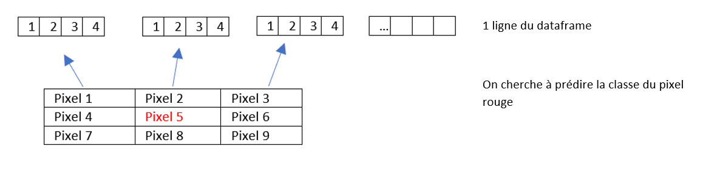
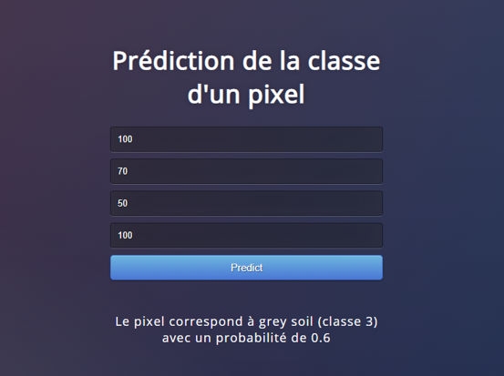

## 1. Contenu du dataset

- La base de donnée consiste a des  valeurs multi spectrale de pixels dans une image satellite. La classe à prédire et le pixel central dans chaque groupe de voisins. La classe à prédire à été transformé et pour des raisons de facilité à des valeurs entre 1 et 7.
Nous avons 4435 valeurs dans le training set et 2000 dans le testing set.

- Chaque image prise par le satellite landsat consiste en 4 différentes images de la meme scène mais prise dans des valeurs spectrales différentes (2 dans le domaine du visible et 2 dans l'infrarouge). Chaque image à une résolution de 2340 x 3380 

- Dans notre dataset, on à une petite partie de l'image (82 x 100 pixels) 

Sur le schéma ci-dessous j'ai représenté 1 ligne du dataframe. La ligne répresente en fait 1 pixel (rouge) qu'on cherche à prédire, ainsi que ces voisins. Comme on peut le voir les pixels sont mis à la ligne les uns a la suite des autres, et chaque pixels est représenté par 4 valeurs entre 0 et 255.

Pour simplifier l'experience utilisateur, nous avons utilisé le modèle qui utilise uniquement les valeurs du pixel 5 pour prédire la classe. L'utilisateur rentre 4 pixels au lieu de 36. Ce modèle est un petit peu moins performant mais donne des resultats suffisants.

## 2. Mode d'emploi

Aller dans le repertoire flask et lancer la commande
- python app.py

Sur la page web vous pouvez voir 4 champs 
- Pixel 1
- Pixel 2
- Pixel 3
- Pixel 4

remplissez les champs avec les valeurs de pixels dont vous souhaitez connaitre la classe.

Appuyez sur le bouton prédiction, vous obtiendrez la classe du pixel, et la probabilité qu'il appartienne à cette classe.

